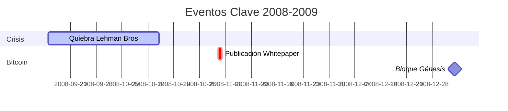
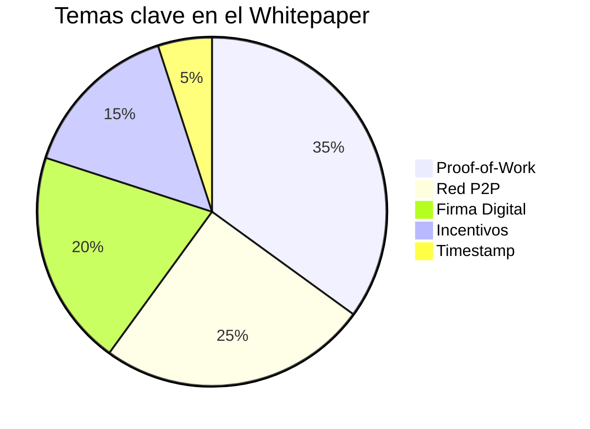
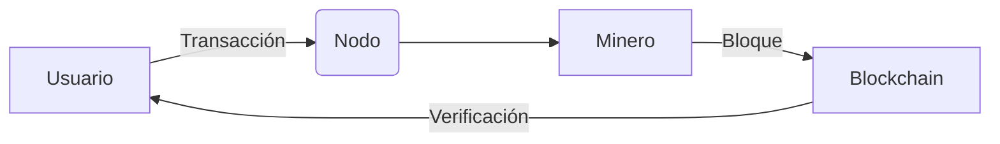
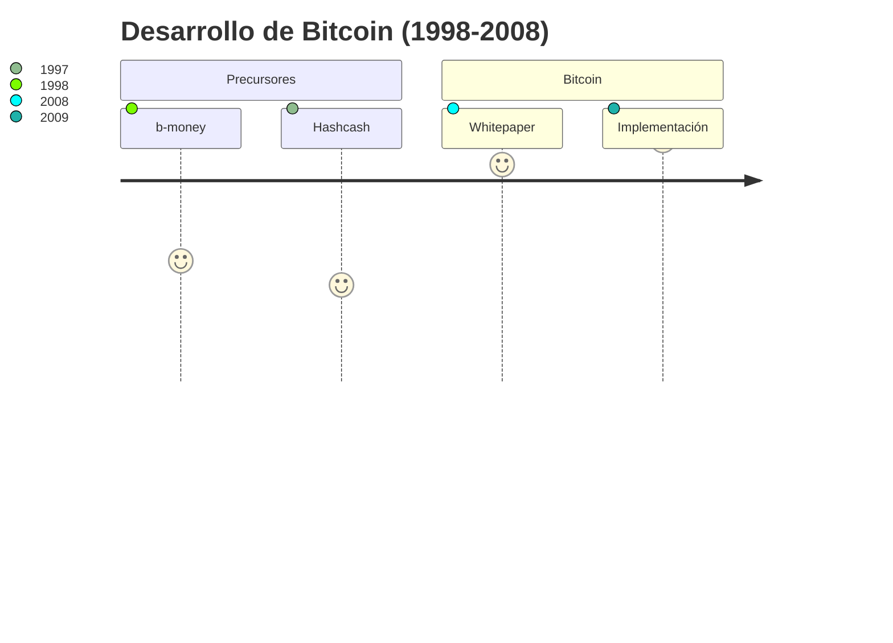
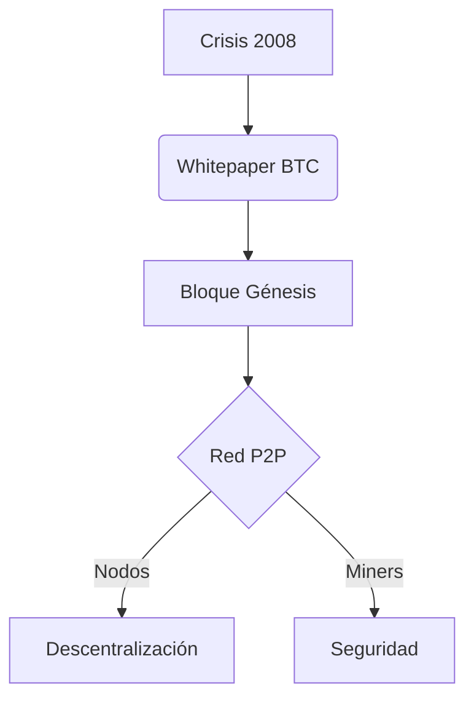
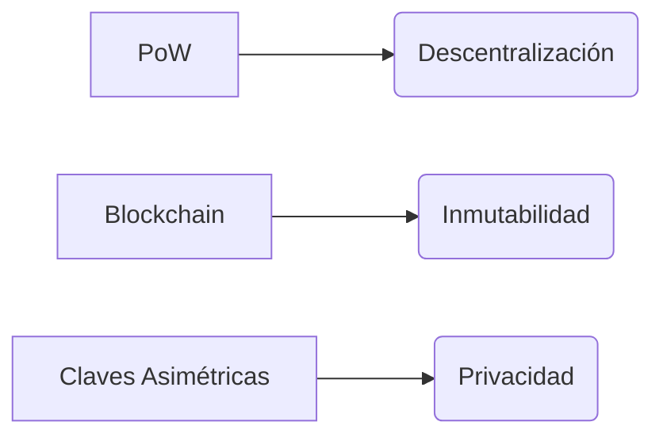

# 🌍 Bitcoin: Análisis Histórico (2008)  
**Estudio del contexto fundacional de la primera criptomoneda**  

## 📅 Línea de Tiempo Crítica

## 🔍 Comparativo Técnico (Whitepaper vs Sistemas Tradicionales)

| **Característica**       | **Bitcoin**                | **Sistema Bancario 2008**   |
|--------------------------|----------------------------|-----------------------------|
| **Autoridad Central**    | ❌ Descentralizado         | ✅ Requerida                |
| **Confianza**            | `Criptográfica (PoW)`      | Institucional               |
| **Transparencia**        |  Público | Auditorías privadas         |
| **Política Monetaria**   | 🔒 Emisión programada       | 🎚 Flexible (FED)           |

## 📌 Contexto Clave (2008)  

### Crisis Financiera vs Bitcoin  
| Evento               | Fecha       | Relación con Bitcoin                  |  
|-----------------------|-------------|---------------------------------------|  
| Quiebra Lehman Bros   | 15/09/2008  | Demostró necesidad de sistemas descentralizados |  
| Whitepaper publicado  | 31/10/2008  | Propuesta directa de alternativa       |  
| Tasa interés Fed (%)  | 0.25        | Contrasta con política monetaria fija de BTC |  

### Comparativo Técnico  
+ Innovación BTC: Sistema P2P sin confianza  
- Sistemas tradicionales: Requieren intermediarios  

## 🧩 Estructura de la Red Inicial

## 🌍 Contexto Global 2008

+ PIB Mundial: -1.7% (Primera contracción desde WWII)
+ Desempleo EE.UU.: 7.2% (Máximo en 16 años)
- Índice S&P 500: -38.5% (Peor año desde 1937)

## 📈 Evolución Conceptual

📈 Gráfico Conceptual

## 🎯 Conclusiones Clave
1. Hallazgos Principales

-Respuesta Tecnológica a la Crisis

-Bitcoin surgió como solución técnica a:

-Fallos sistémicos bancarios

-Políticas monetarias discrecionales

-Centralización del control financiero

2. Innovaciones Disruptivas

3. Legado Permanente

-Impacto	Ejemplo Actual

-Tecnológico	Smart Contracts (Ethereum)

-Económico	Criptoeconomía DeFi

-Social	Movimiento Web3

## 📚 Referencias Fundamentales
Documentos Primarios
Nakamoto, S. (2008)
Bitcoin: A Peer-to-Peer Electronic Cash System
Whitepaper original con la especificación técnica

Federal Reserve (2008)
*Transcript of FOMC Meeting - October 2008*
Contexto económico durante el lanzamiento

Análisis Históricos
Antonopoulos, A. (2014)
Mastering Bitcoin (Cap. 1: "What is Bitcoin?")
Análisis técnico de la arquitectura inicial

P2P Foundation (2009)
Satoshi Nakamoto's Posts
Comentarios del creador en foros históricos

Datos Económicos
World Bank (2009)
Global Development Finance Report
*Estadísticas macroeconómicas de 2008-2009*
